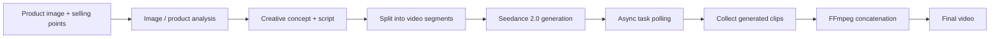
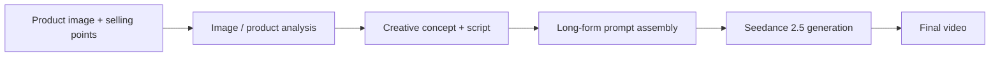

# AI Video Generation Workflow

An evolving **n8n-based AI video generation pipeline** for producing short-form promotional videos from a product image and selling points.

The project contains two versions of the same system and documents how the architecture changed as the underlying video model improved:

- **V1 — Seedance 2.0:** segmented generation, asynchronous task polling, and FFmpeg concatenation to work around video-length limits.
- **V2 — Seedance 2.5:** a simplified direct-generation workflow after longer native video generation became available.

> This repository is an experimental portfolio project. It has been tested across **50+ generated video outputs**, but it has not been production-hardened or commercially deployed.

[中文说明 / Chinese README](README.zh-CN.md)

## Why this project exists

Early versions of the video model could not reliably generate a complete 20–30 second video in one request. Instead of treating that as a blocker, V1 split the job into fixed-length segments, generated each segment independently, polled asynchronous generation jobs until completion, and stitched the resulting clips together with FFmpeg.

When Seedance 2.5 introduced longer native generation, much of that orchestration became unnecessary. V2 was therefore redesigned to remove avoidable complexity rather than preserve it for its own sake.

The project is mainly a study in **workflow orchestration, multimodal AI, asynchronous APIs, error handling, and architectural simplification**.

## Architecture evolution

| Version | Main approach | Engineering reason |
|---|---|---|
| **V1 — Seedance 2.0** | Segment → generate → poll → collect → FFmpeg concat | Worked around generation-duration constraints |
| **V2 — Seedance 2.5** | Direct longer-form generation | Removed orchestration that the newer model no longer required |

### V1 — Seedance 2.0



### V2 — Seedance 2.5



The diagrams are intentionally high-level. See [docs/architecture.md](docs/architecture.md) for the engineering rationale behind each version.

## What the workflow does

At a high level, the pipeline:

1. Accepts a product image, selling points, target duration, and output count.
2. Uses a multimodal model to extract visual characteristics from the product image.
3. Uses LLM stages to generate a creative angle, character/art direction, localized dialogue, and structured prompts.
4. Sends the resulting prompt(s) to Seedance for video generation.
5. Handles asynchronous generation and result collection.
6. In V1, stitches multiple generated clips into one final video through FFmpeg.
7. Returns or distributes the generated output through downstream workflow steps.

## Tech stack

- **n8n** — workflow orchestration
- **Seedance** — video generation
- **Gemini / multimodal model** — image understanding
- **DeepSeek / LLM stages** — creative planning, script generation, prompt synthesis
- **OpenRouter** — model access used in the experimental workflow
- **FFmpeg** — local video concatenation in V1
- **Cloudflare R2 / S3-compatible storage** — temporary public image hosting in the original workflow
- **Claude Code** — used extensively during development, debugging, and iteration

Claude is **not** called through the runtime workflow in this repository; Claude Code was used as a development tool.

## Repository structure

```text
ai-video-generation-workflow/
├── README.md
├── README.zh-CN.md
├── LICENSE
├── SECURITY.md
├── .gitignore
├── workflows/
│   ├── v1-seedance-2.0-segmented.json
│   └── v2-seedance-2.5-direct.json
├── docs/
│   └── architecture.md
└── demos/
    └── README.md
```

## Importing the workflows

Both files under `workflows/` are n8n workflow exports.

1. Create a new workflow in n8n.
2. Import the desired JSON file.
3. Reconnect the required credentials in n8n.
4. Replace all public placeholders with your own configuration.
5. Review model names and third-party API schemas before running the workflow, as providers can change them over time.

### Public placeholders

The published workflows intentionally contain placeholders such as:

```text
YOUR_SEEDANCE_API_KEY
YOUR_OPENROUTER_API_KEY
YOUR_PUBLIC_R2_DOMAIN
YOUR_FEMALE_VOICE_ID
YOUR_MALE_VOICE_ID
BACKEND_API_KEY
```

They are **not working credentials**. Do not commit real API keys into workflow JSON files.

## V1: engineering around a model limitation

The first version is deliberately more complex. Its generation layer uses multiple fixed-duration segments and includes:

- segment-level metadata preservation;
- asynchronous task IDs;
- polling and retry / timeout handling;
- result collection;
- final clip concatenation through an FFmpeg service.

This architecture existed because a single generation request was not sufficient for the target output duration at the time.

## V2: removing unnecessary complexity

The second version reflects a different engineering decision: **when the platform removes a constraint, remove the workaround too**.

With longer native generation available, the pipeline could be simplified. This reduces moving parts, failure points, and maintenance overhead.

The goal of V2 was not to make the workflow look technically complicated; it was to make it easier to understand and operate.

## Results and limitations

### Tested

- 50+ experimental video outputs generated across iterations.
- Multiple product images and creative variations tested.
- The complete workflow was used as a prototype and portfolio project.

### Not claimed

- No production SLA.
- No commercial deployment or paying customer usage.
- No guarantee that third-party API endpoints or model identifiers still match the latest provider versions.

## Demo

A separate portfolio site contains selected output examples and visual demonstrations.

**Portfolio:** `[ADD_PORTFOLIO_URL]`

See [demos/README.md](demos/README.md) for notes on adding public examples without committing large video files to this repository.

## Security

The public workflow files have been sanitized to remove private credentials, personal addresses, webhook IDs, local user paths, and instance-specific identifiers.

Please read [SECURITY.md](SECURITY.md) before importing or modifying them.

## License

Released under the [MIT License](LICENSE).

---

Built as an experimental AI automation project and iterated with Claude Code.
