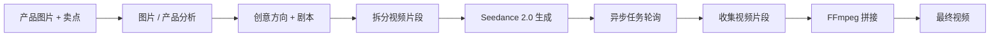
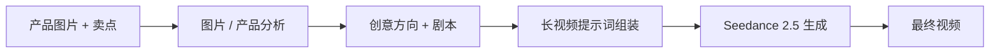

# AI 视频生成自动化工作流

这是一个基于 **n8n 的 AI 短视频生成工作流**，输入产品图片和卖点后，通过多个 AI 模型和自动化节点生成短视频。

仓库同时保留了两个版本，用来展示同一个系统随着底层视频模型能力提升而发生的架构演进：

- **V1 — Seedance 2.0：** 为绕过视频时长限制，采用分段生成、异步轮询和 FFmpeg 拼接。
- **V2 — Seedance 2.5：** 模型支持更长的原生视频生成后，删除不再需要的分段与拼接逻辑，简化整体架构。

> 这是一个实验性作品集项目。整个迭代过程中已经测试并生成 **50+ 个视频输出**，但没有宣称已经达到生产环境标准，也没有投入商业客户使用。

[English README](README.md)

## 为什么做这个项目

早期的视频模型无法稳定地一次性生成完整的 20–30 秒视频。因此 V1 没有把模型限制当成项目阻塞，而是把视频拆成多个固定时长片段，逐段调用模型生成，通过任务 ID 轮询异步结果，最后使用 FFmpeg 将多个片段拼接成完整视频。

后来 Seedance 2.5 支持更长的原生视频生成，这套 workaround 就不再必要。因此 V2 重新设计了工作流，主动删除多余的 orchestration，而不是为了“看起来复杂”继续保留旧架构。

这个项目主要展示的是：**工作流编排、多模态 AI、异步 API、错误处理，以及随着底层平台能力变化进行架构简化的过程。**

## 架构演进

| 版本 | 主要方式 | 工程原因 |
|---|---|---|
| **V1 — Seedance 2.0** | 分段 → 生成 → 轮询 → 汇总 → FFmpeg 拼接 | 绕过单次生成时长限制 |
| **V2 — Seedance 2.5** | 更长视频直接生成 | 新模型移除了旧限制，因此删除多余复杂度 |

### V1 — Seedance 2.0



### V2 — Seedance 2.5



更详细的设计思路见 [docs/architecture.md](docs/architecture.md)。

## 工作流主要做什么

整体流程大致包括：

1. 输入产品图片、卖点、目标时长和生成数量。
2. 使用多模态模型识别产品图片中的视觉特征。
3. 使用多个 LLM 阶段完成创意方向、人物/美术设定、本地化台词和结构化提示词生成。
4. 调用 Seedance 生成视频。
5. 处理异步任务以及结果收集。
6. V1 中将多个视频片段通过 FFmpeg 拼成完整视频。
7. 通过后续节点返回或分发生成结果。

## 技术栈

- **n8n** — 自动化编排
- **Seedance** — 视频生成
- **Gemini / 多模态模型** — 图片理解
- **DeepSeek / LLM** — 创意、脚本和提示词处理
- **OpenRouter** — 实验工作流中的模型访问
- **FFmpeg** — V1 的本地视频拼接
- **Cloudflare R2 / S3 兼容存储** — 原工作流中的临时图片公网托管
- **Claude Code** — 开发、调试和迭代过程中大量使用

需要特别说明：**Claude 并没有作为运行时 API 出现在这套工作流中。Claude Code 是开发工具。**

## 仓库结构

```text
ai-video-generation-workflow/
├── README.md
├── README.zh-CN.md
├── LICENSE
├── SECURITY.md
├── .gitignore
├── workflows/
│   ├── v1-seedance-2.0-segmented.json
│   └── v2-seedance-2.5-direct.json
├── docs/
│   └── architecture.md
└── demos/
    └── README.md
```

## 如何导入

`workflows/` 中的两个文件都是 n8n workflow export。

1. 在 n8n 新建 workflow。
2. 导入对应 JSON。
3. 在自己的 n8n 中重新绑定所需 credentials。
4. 将所有公开占位符替换成自己的配置。
5. 运行前检查最新的模型名称与第三方 API schema，因为服务商接口可能发生变化。

### 公开占位符

工作流中有意保留了这些占位符：

```text
YOUR_SEEDANCE_API_KEY
YOUR_OPENROUTER_API_KEY
YOUR_PUBLIC_R2_DOMAIN
YOUR_FEMALE_VOICE_ID
YOUR_MALE_VOICE_ID
BACKEND_API_KEY
```

它们都**不是真实凭证**。不要把真正的 API Key 硬编码后上传到 GitHub。

## V1：针对模型限制设计 workaround

第一版技术结构更复杂，主要包含：

- 视频片段级上下文和元数据保留；
- 异步 task ID；
- 轮询、重试和超时处理；
- 多片段结果汇总；
- 通过本地 FFmpeg 服务完成最终拼接。

这套结构不是为了增加复杂度，而是当时为了突破单次视频生成时长限制而产生的工程方案。

## V2：主动删除不必要的复杂度

第二版体现的是另一个工程原则：**底层约束消失以后，就把 workaround 一起删掉。**

更长视频可以直接生成之后，工作流减少了移动部件、潜在故障点和维护成本。

V2 的目标不是“看起来技术更复杂”，而是更简单、更容易理解和维护。

## 测试结果与边界

### 已经验证

- 在多个迭代版本中累计测试并生成 50+ 个视频输出。
- 测试过不同产品图片和不同创意方向。
- 完整工作流作为 prototype 和 portfolio 项目运行过。

### 不做的声明

- 不宣称已经达到生产环境 SLA。
- 没有商业化部署，也没有付费客户正式使用。
- 不保证第三方 API endpoint 和模型 ID 永久保持兼容。

## Demo

独立的个人 Portfolio 网站展示了部分视频结果和工作流演示。

**Portfolio：** `[添加你的 Portfolio URL]`

关于如何添加公开 demo 而不把大体积视频直接塞进 Git 仓库，可以查看 [demos/README.md](demos/README.md)。

## 安全

公开版本已经清理私人 API key、个人邮箱、真实 webhook、用户本地路径、n8n 实例标识等信息。

导入前请阅读 [SECURITY.md](SECURITY.md)。

## License

使用 [MIT License](LICENSE)。

---

这是一个实验性 AI automation 项目，开发和迭代过程中使用了 Claude Code。
